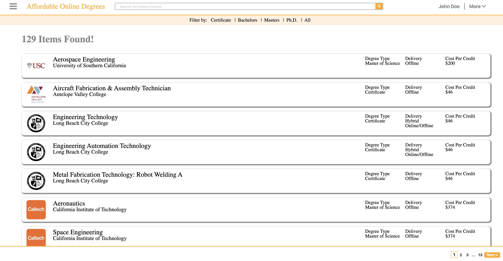
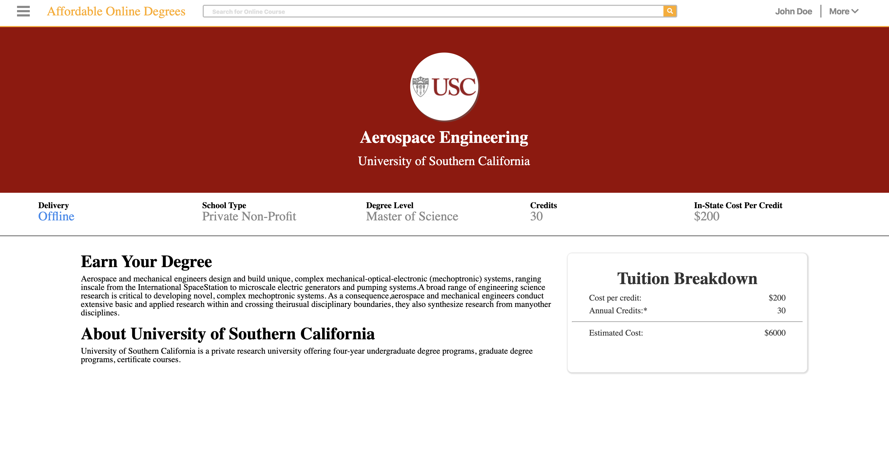

# Cluster - Developer Challenge Key

## Setup
* Clone the github repo
* Run: npm run inst
* Run: npm run start:api
* Run: npm run start:web
* Install the visual studio code plugin Todo Tree
    * This is there to help you identify the action items

## Notes:
* Frontend is written using NextJS
* API is written using GraphQL-Yoga
* User interface is styled using styled-components

## Functional Requirements
* Page design should match the attached design (no need to suppoort responsiveness)
* Programs listing should be loaded from api.
* Users should be able to search for the programs, sort and paginate them.

## Technical requirements
* Code should be written with TypeScript

# Home Page

# Detail Page
